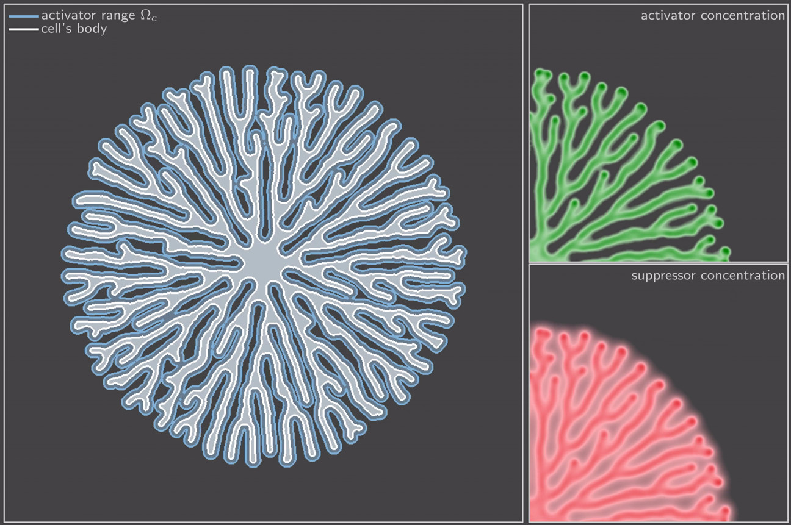

# Dendrites
This repository contains source code for the simulation of the growth of
dendritic structures in a reaction-diffusion-model. Note that this code is
poorly optimized.

## Requirements
The execution depends on the [`fft3`-library](https://www.fftw.org/download.html) and requires in particular
the corresponding [Fortran-interface](https://fftw.org/doc/Overview-of-Fortran-interface.html), `fftw3.f03`.

## Compile
The repository contains an example simulation in `examples/run.f90`.
Compile using, for example, the command
```
gfortran lib/fftw2d.f90 lib/integrator.f90 examples/run.f90 -lfftw3 -O3 -o run
```
Afterwards, run via
```
mkdir data && ./run
```
The results are then written into the `data`-directory in matrix format.


## Example
The image below show the result of a single simulation. For the full animation evolution see [this video](https://youtu.be/Zty1shO7SRI).

